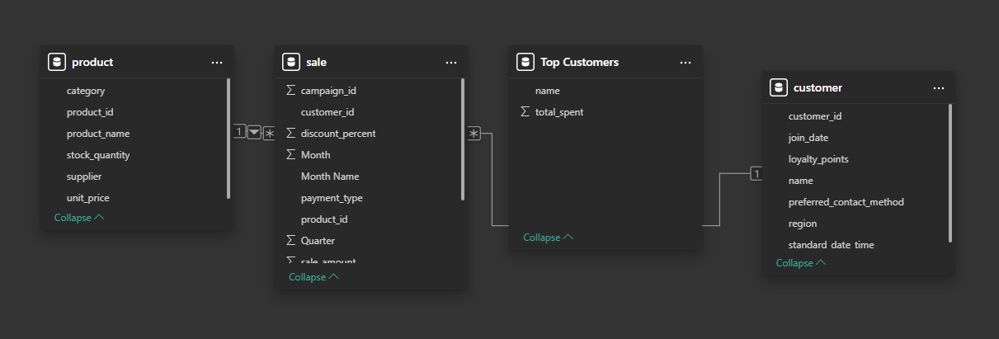
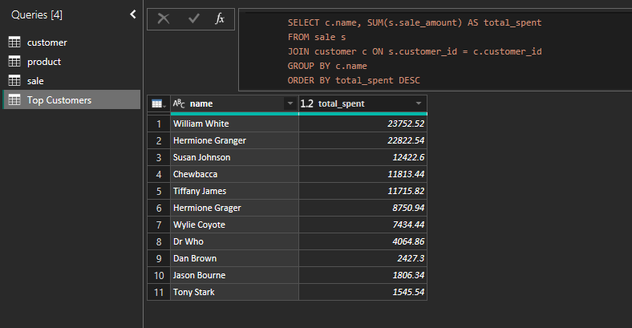
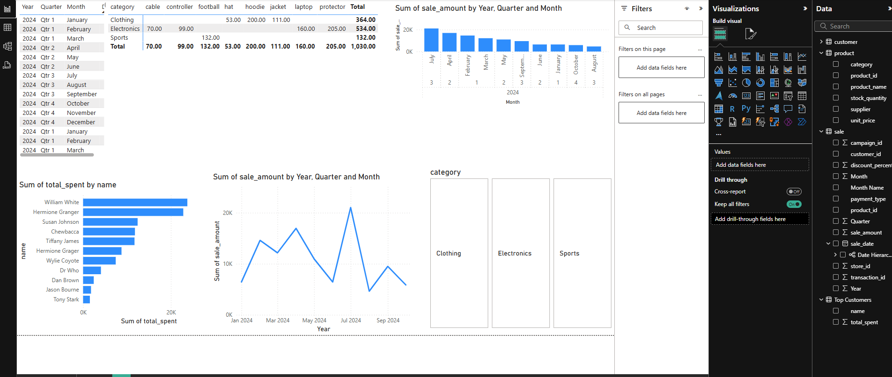

# smart-store-egbogbo


# Project Initialization

## Step 1: Create GitHub Repository

Name the repository: smart-store-yourname

Select the public option

Add a ReadME file

Click "Create" to finalize the repository

## Step 2: Clone Repository to Local Machine

Open VS Code and open your local projects folder

Copy the URL of your repository

In VS Code, open a new terminal and run the following command:

git clone "your repository URL"

## Step 3: Create .gitignore and requirements.txt files

In the newly cloned project repository, create a new file named exactly: .gitignore and paste the following:

```bash
# This .gitignore file lists content that does NOT need to be tracked in the project history

# Python virtual environment folder
.venv/

# Visual Studio Code settings and workspace folder - Ignore entire .vscode folder except settings.json
.vscode/*
!.vscode/settings.json

# Compiled Python files
__pycache__/

# macOS system files
.DS_Store

# Jupyter Notebook checkpoint files
.ipynb_checkpoints
```

Now create a new file named exactly: requirements.txt and paste the following:

```bash
pip
loguru
ipykernel
jupyterlab
numpy
pandas
matplotlib
seaborn
plotly
pyspark==4.0.0.dev1
pyspark[sql]
git+https://github.com/denisecase/datafun-venv-checker.git#egg=datafun_venv_checker
```

## Step 4: Git add-commit-push

```bash
git add .
git commit -m "Add .gitignore and requirements.txt files"
git push -u origin main
```

## Step 5: Create and Activate Virtual Environment

Open a new terminal in your project repository

Run the following commands: 

```bash
py -m venv .venv
```
```bash
.venv\Scripts\activate
```
## Step 6: Install Dependencies
Make sure .venv is created and active

Update key packages and install dependencies from the requirements.txt file

Run the following commands in your terminal:
```bash
.\.venv\Scripts\activate
py -m pip install --upgrade pip setuptools wheel
py -m pip install -r requirements.txt
```
# To complete Project 2

## Step 1: Create utils/logger.py and scripts/data.prep.py

In your project repository, create a new folder named exactly: utils

In the utils folder, create a new file named exactly: logger.py

    Copy and paste the contents for the logger file - check example

Now, create a new folder named exactly: scripts

    In the scripts folder, create a new file named exactly: data_prep.py

        Copy and paste the contents from the data.prep.py file - check example

## Step 2: Execute Python Script

In terminal, run the following command: 

```bash
py scripts\data_prep.py
```

## Step 3: Git-Add-Commit-Push to GitHub

```bash
git add .
git commit -m "Add starter files"
git push
```

# To complete Project 3

## Step 1: Create scripts/data_scrubber.py

In your scripts folder in your project, create a file named: data_scrubber.py

Copy and paste the code from the example repo - https://github.com/denisecase/smart-sales-docs/

Complete the TODO tasks in the data_scrubber.py script

## Step 2. Create tests/test_data_scrubber.py

Create a folder in your project named: tests

Create a file in the test folder named: test_data_scrubber.py

Copy and paste the code from the example repo.

In the terminal, run the following command to test the DataScrubber:
```bash
py tests\test_data_scrubber.py
```
Verify that the test script ran without fail. 

## Step 3: Use the DataScrubber by execute data_prep.py

In the terminal, run the following command to run the data_prep.py script:
```bash
py scripts\data_prep.py
```
# To complete Project 4

## Step 1. Design Data Warehouse

Create a suitable schema for for your data warehouse (star, snowflake or another dimensional) - whatever best suits your need. (We used the star schema in our project.)

Sketch out the selected schema to describe how the database is structured

# Step 2. Create Data Warehouse

In the scripts folder, create a new file named etl_to_dw.py

Optional: Create a separate SQL file in script to create and test your SQL statements to create the tables and relationships in SQLite. - see example repo

In the etl_to_dw.py file, copy and paste script from the example in the example repo and adjust to match your schema and prepared data. 

## Step 3. Execute Script to Create Data Warehouse

Once adjusted, use terminal to execute the file by using the following command:
```bash
py scripts/etl_to_dw.py
```
Verify your newly created data warehouse to ensure it makes the design of your schema. 

# Project 5 - Cross Platform Reporting with Power BI

## SQL Queries and Reports
- Created a Top Customer Query that joins the sales table with the customer table, adds up the sale amounts of each customer, and sorts the results from high to low. 
- Created a Top Customer bar chart to show the highest spending customers
- Created a Sales Trend line chart to show sales performance over time

## Dashboard Design Choices
- The bar chart for Top Customers is based off total purchases
- The line chart for Sales Trend displays sales over the year, quarter, and month
- A slicer was created to filter all the visuals by product category

## Power BI Model View


## SQL Query Results


## Final Dashboard
